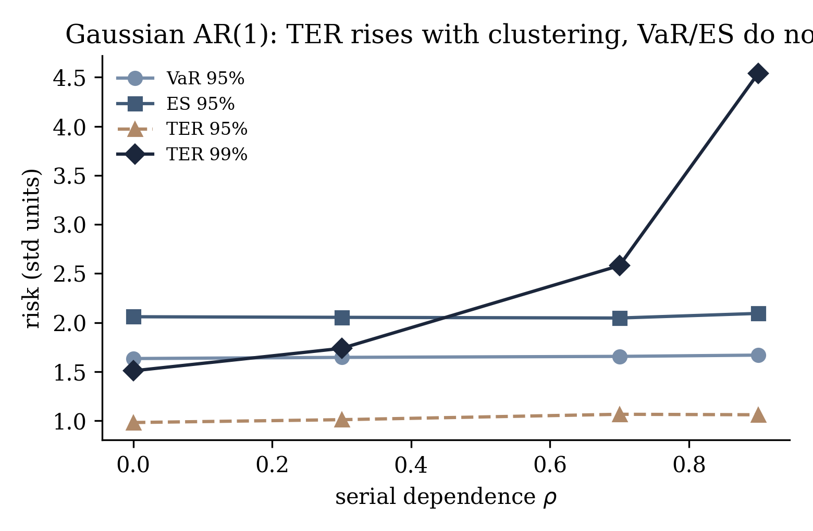
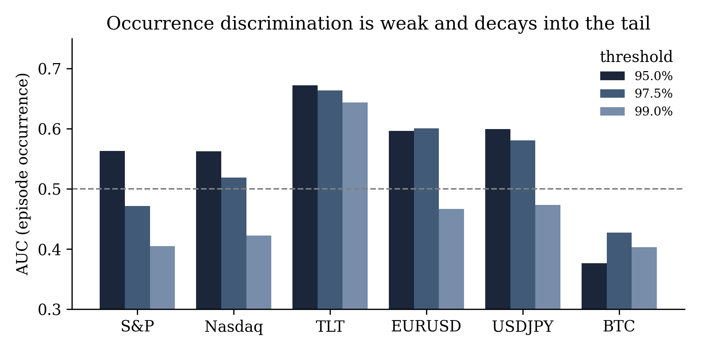
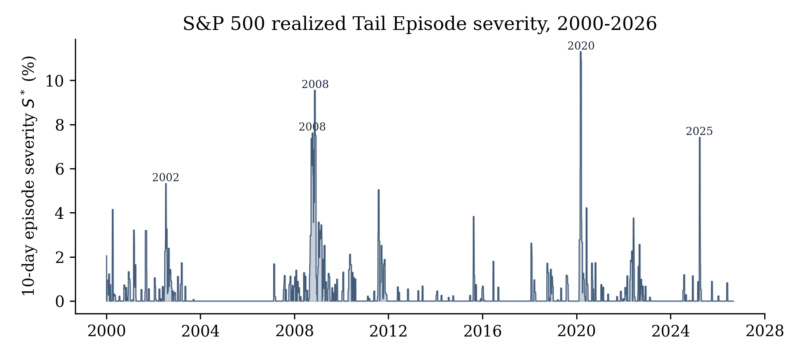
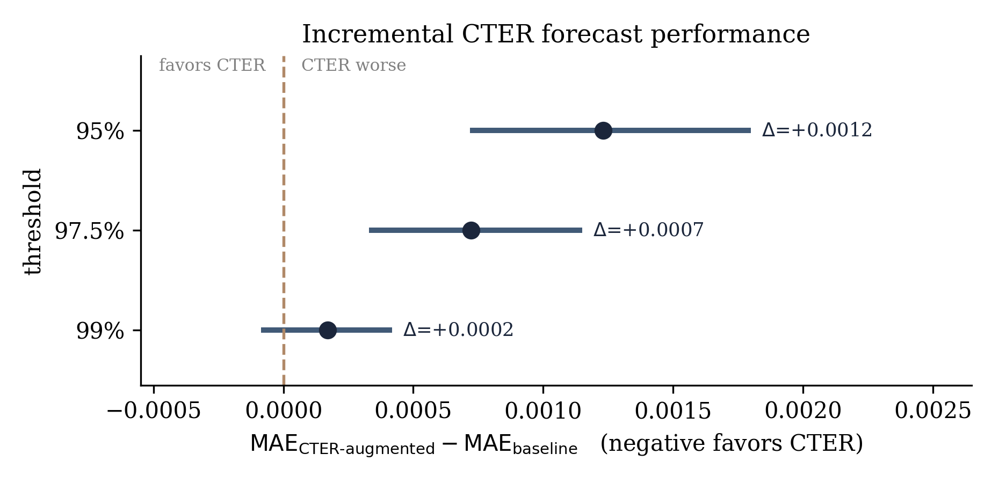

# Conditional Tail Episode Risk (CTER)

## A Path-Dependent Framework for Extreme-Loss Episodes Beyond Value-at-Risk and Expected Shortfall

**Niraj Neupane**
*Quantitative Finance · Financial Econometrics · Financial Risk Management · AI/ML*


---

## Research at a Glance

> **Extreme losses are not only about how large losses become. They are also about how extreme losses organize themselves through time.**

Value-at-Risk (VaR) and Expected Shortfall (ES) are fundamental tools for measuring financial tail risk, but they primarily characterize the **marginal distribution of losses**. This project develops **Tail Episode Risk (TER)** and **Conditional Tail Episode Risk (CTER)** as a complementary framework for the **temporal structure and cumulative severity of extreme-loss episodes** over a forecast horizon.

Instead of asking only *how large can an individual tail loss be?*, the framework asks *what happens when extreme losses persist and form an episode?*

The framework is **not** positioned as a replacement for VaR or ES. The empirical results are deliberately reported in full, including negative findings.

> **Headline result.** TER is a distinct, well-characterized *path-dependent risk functional*: two loss paths with identical VaR and ES can have very different episode severity, and simulations confirm episode risk rises sharply with serial dependence. **However**, on 2000–2026 data across six markets, conditioning on the full CTER feature set does **not** improve out-of-sample episode-severity forecasts over a parsimonious volatility baseline — it is significantly worse at 95%/97.5% and statistically indistinguishable at 99%. Measure innovation and forecasting performance are separate things, and this repository keeps them separate.

---

## Table of Contents

- [The Problem](#the-problem)
- [Core Idea](#core-idea)
- [Tail Episode Risk (TER)](#tail-episode-risk-ter)
- [Conditional Tail Episode Risk (CTER)](#conditional-tail-episode-risk-cter)
- [VaR vs ES vs TER vs CTER](#var-vs-es-vs-ter-vs-cter)
- [Worked Example](#worked-example)
- [Theoretical Properties](#theoretical-properties)
- [Monte Carlo Experiments](#monte-carlo-experiments)
- [Adversarial Stress Tests](#adversarial-stress-tests)
- [Empirical Design](#empirical-design)
- [VaR/ES Benchmark Results](#vares-benchmark-results)
- [CTER Out-of-Sample Results](#cter-out-of-sample-results)
- [Incremental Information Test](#incremental-information-test)
- [What the Results Mean](#what-the-results-mean)
- [Relation to Existing Literature](#relation-to-existing-literature)
- [Novelty Position](#novelty-position)
- [Limitations](#limitations)
- [Future Research](#future-research)
- [Repository Structure](#repository-structure)
- [Reproducibility](#reproducibility)
- [Data](#data)
- [Citation](#citation)
- [Disclaimer](#disclaimer)
- [License](#license)

---

## The Problem

Financial tail risk is usually summarized with marginal measures. **VaR** answers *what loss threshold is exceeded with a given probability?* and **ES** answers *how severe is the loss beyond that threshold on average?* Neither describes how extreme observations are **organized across time**.

```
Path A:  4   0   4   0   4   0      three isolated exceedances
Path B:  4   4   4   0   0   0      one persistent episode
```

The two paths contain the *same individual observations* — so identical VaR and ES — but very different temporal structure. This motivates a path-dependent risk functional.

---

## Core Idea

```
   FUTURE LOSS PATH
          │
          ▼
   Tail threshold  q(t, α)
          │
          ▼
   Identify exceedances
          │
          ▼
   Form contiguous episodes
          │
          ▼
   Measure episode severity
          │
          ▼
   Select the worst episode  →  TER / CTER
```

The framework moves from **individual observations** → **episodes** → **cumulative episode severity** → **tail risk of the worst episode**.

---

## Tail Episode Risk (TER)

For a forecast origin `t` and horizon `H`, the future loss path is
**L**(t,H) = (L(t+1), …, L(t+H)), with tail-loss threshold `q(t,α)`.

**Threshold exceedance** (only losses above the threshold contribute):

```
y(t+k) = max( L(t+k) − q(t,α), 0 )
```

**Episode severity.** For a contiguous exceedance episode `j` with index set 𝒦(t,H,j):

```
S(t,H,j) = Σ_{k ∈ 𝒦(t,H,j)}  ( L(t+k) − q(t,α) )₊
```

**Worst episode** over the horizon (zero if no exceedance occurs):

```
S*(t,H) = max_j  S(t,H,j)
```

**Tail Episode Risk** — the upper-tail quantile of the worst-episode severity, conditional on information ℱ(t):

```
TER(α,β,H,t) = Q_β(  S*(t,H)  |  ℱ(t) )
```

where `α` = threshold level, `β` = upper-tail probability applied to episode severity, `H` = horizon.

> **TER answers:** *How severe can the worst cumulative extreme-loss episode become over the forecast horizon?*

---

## Conditional Tail Episode Risk (CTER)

Define the **episode-occurrence** event:

```
O(t,H) = 1[  max_{1≤k≤H} L(t+k) > q(t,α)  ]
```

CTER decomposes episode risk into an occurrence probability and a conditional severity:

```
CTER(α,β,H,t) = P( O(t,H)=1 | X_t )  ×  ES_β[ S*(t,H) | O(t,H)=1, X_t, Z_t ]
```

```
                    CTER
        ┌─────────────┴─────────────┐
        ▼                           ▼
 Episode probability          Episode severity
 P(O = 1 | X)               ES_β(S* | O=1, X, Z)
        └─────────────┬─────────────┘
                      ▼
                     CTER
```

- `X_t` — observable state at the forecast origin (returns, realized volatility, drawdown, stress indices, …)
- `Z_t` — episode-state information (recent exceedance frequency, current run length, recent episode severity)

> Two distinct questions: **how likely** is an extreme-loss episode, and **if it occurs, how severe** could it become?

---

## VaR vs ES vs TER vs CTER

| Measure  | Primary object                                     | Perspective    | Path-dependent? |
| -------- | -------------------------------------------------- | -------------- | --------------- |
| **VaR**  | Tail-loss threshold                                | Marginal       | No              |
| **ES**   | Average severity beyond the threshold              | Marginal       | No              |
| **TER**  | Upper tail of worst cumulative exceedance episode  | Path-dependent | Yes             |
| **CTER** | Episode probability × conditional episode severity | Conditional    | Yes             |

The objective is **not** to replace VaR or ES, but to test whether episode information is a distinct dimension of tail risk.

---

## Worked Example

```
Path A = (4, 0, 4, 0, 4, 0)      Path B = (4, 4, 4, 0, 0, 0)      q = 2
```

Exceedances are `2 0 2 0 2 0` for A and `2 2 2 0 0 0` for B. In A they are separated → `S*_A = 2`; in B they form one episode → `S*_B = 6`. Therefore

```
VaR_A = VaR_B   and   ES_A = ES_B        (identical marginals)
                but   TER_A ≠ TER_B      (different temporal organization)
```

---

## Theoretical Properties

- **Monotonicity.** Under a common threshold, increasing the loss path cannot reduce episode burden ⇒ `TER(L') ≥ TER(L)`.
- **Positive homogeneity** (consistent scaling). If `L' = cL`, `q' = cq`, `c > 0`, then `TER(cL) = c·TER(L)`.
- **Translation invariance** (translation-equivariant threshold rule). If losses and threshold shift together (`L' = L + c`, `q' = q + c`), exceedances — and hence `S*` — are unchanged, so `TER' = TER`.
  *Note:* VaR and ES are translation **equivariant** (`ρ(L+c) = ρ(L)+c`); TER is a **severity/deviation** functional, so the correct property is **invariance** (`D(L+c) = D(L)`), not equivariance. TER neither satisfies nor targets monetary equivariance.
- **Temporal-clustering sensitivity.** Constructed paths with identical marginals produce different `S*` — the defining distinction from marginal tail measures.
- **Coherence is *not* claimed.** Subadditivity requires separate analysis because the threshold is distribution-dependent and the worst-episode operator is nonlinear. TER is treated as a **path-dependent tail-risk functional**, not automatically a coherent risk measure.

---

## Monte Carlo Experiments

Stationary AR(1) processes with **standardized** innovations hold the marginal variance fixed while dependence `ρ` varies. VaR/ES are computed from the stationary marginal; TER from rolling horizon paths (`H = 10`, 20,000 windows, threshold α = 95%). See `src/04_simulation.py`.

**Gaussian AR(1)**

| ρ   | VaR 95% | ES 95% | TER 95% | TER 99% |
| --- | ------- | ------ | ------- | ------- |
| 0.0 | 1.633   | 2.059  | 0.981   | 1.508   |
| 0.3 | 1.645   | 2.053  | 1.010   | 1.737   |
| 0.7 | 1.655   | 2.046  | 1.065   | 2.580   |
| 0.9 | 1.668   | 2.093  | 1.060   | 4.541   |

**Student-t AR(1)** (standardized to unit variance)

| ρ   | VaR 95% | ES 95% | TER 95% | TER 99% |
| --- | ------- | ------ | ------- | ------- |
| 0.0 | 1.560   | 2.233  | 1.494   | 3.130   |
| 0.3 | 1.562   | 2.199  | 1.530   | 2.979   |
| 0.7 | 1.579   | 2.134  | 1.482   | 4.141   |
| 0.9 | 1.622   | 2.106  | 1.304   | 5.281   |

Marginal VaR/ES stay essentially flat while **TER 99% rises from ≈1.5 to ≈4.5** (Gaussian). Temporal dependence materially changes episode risk without proportionally changing marginal tail measures.



---

## Adversarial Stress Tests

Six 60-observation loss paths under a **common, fixed** threshold `q = 2.5` (standardized units), so differences reflect temporal organization rather than a path-specific threshold. See `src/05_stress_tests.py`.

| Scenario                            | VaR 95% | ES 95% | S\*   |
| ----------------------------------- | ------- | ------ | ----- |
| Isolated crash                      | 1.42    | 4.00   | 6.50  |
| Tail thickening (separated spikes)  | 6.00    | 6.00   | 3.50  |
| Liquidity collapse (sustained run)  | 3.50    | 3.50   | 12.00 |
| Volatility explosion (cluster)      | 6.42    | 7.68   | 25.62 |
| Broad contagion (all elevated)      | 3.39    | 4.01   | 2.40  |
| Escalating deterioration            | 3.58    | 4.52   | 7.80  |

The decisive comparison: **tail thickening** has the *highest* VaR/ES (6.00) but a *small* episode (`S* = 3.5`), while the **liquidity collapse** has *lower* VaR/ES (3.50) but a much larger `S* = 12.0`. VaR/ES and TER measure different dimensions of stress rather than producing a common ranking. The current TER is **univariate**; the contagion row is illustrative only.

---

## Empirical Design

| Item | Value |
| --- | --- |
| Assets | S&P 500, Nasdaq, TLT, EUR/USD, USD/JPY, Bitcoin |
| Sample | 2000–2026 daily (TLT from 2002; Bitcoin from 2014) |
| Stress variables | VIX (daily); NFCI, STLFSI (weekly, LOCF to daily) |
| Estimation window | 1,250 observations (rolling) |
| Horizon | **10-day observation horizon** (10 trading days for exchange-traded assets; 10 calendar days for Bitcoin, which trades 24/7) |
| Threshold levels | 95%, 97.5%, 99% |
| Benchmarks | Historical Simulation, EWMA-Normal, EVT/POT (GPD), GARCH(1,1)-t |

**Out-of-sample windows are asset-specific** (the estimation window and burn-in consume the first 1,502 observations):

| Asset | OOS start | OOS observations |
| --- | --- | --- |
| S&P 500, Nasdaq | Dec 2005 | 4,827 |
| EUR/USD, USD/JPY | Dec 2005 | 4,802 |
| TLT | Jul 2008 | 4,183 |
| Bitcoin | Oct 2018 | 2,496 |

Conventional VaR/ES are scored with the strictly consistent **0-homogeneous Fissler–Ziegel (FZ0)** loss. CTER occurrence is scored by Brier and AUC; severity by MAE and RMSE. No post-out-of-sample tuning is used.

---

## VaR/ES Benchmark Results

Mean **FZ0** score across assets (lower = better); best per level in **bold**.

| Level | Hist. Sim. | EWMA-Normal | EVT-POT | GARCH-t     |
| ----- | ---------- | ----------- | ------- | ----------- |
| 95%   | −3.627     | −3.768      | −3.618  | **−3.789**  |
| 97.5% | −3.395     | −3.535      | −3.383  | **−3.590**  |
| 99%   | −3.127     | −3.177      | −3.092  | **−3.350**  |

**GARCH-t is the strongest benchmark at every level, with EWMA-Normal a strong second.** Historical Simulation and EVT are best calibrated by breach rate but weaker under the joint score; EWMA-Normal over-breaches at 99% (≈1.99% vs a 1% target). These competitive baselines — not a deliberately weak model — are what CTER must beat.

---

## CTER Out-of-Sample Results

Occurrence discrimination (Brier, AUC) and severity accuracy (MAE, RMSE). AUC below 0.5 is worse-than-random. See `src/02_cter_pipeline.py`.

| Asset | Level | Base rate | Brier | AUC | MAE | RMSE |
| ----- | ----- | --------- | ----- | --- | --- | ---- |
| S&P 500 | 95% | 0.317 | 0.249 | 0.563 | 0.00652 | 0.01436 |
| S&P 500 | 97.5% | 0.179 | 0.209 | 0.471 | 0.00489 | 0.01256 |
| S&P 500 | 99% | 0.098 | 0.130 | 0.405 | 0.00318 | 0.01012 |
| Nasdaq | 95% | 0.328 | 0.257 | 0.563 | 0.00661 | 0.01415 |
| Nasdaq | 97.5% | 0.193 | 0.182 | 0.519 | 0.00470 | 0.01280 |
| Nasdaq | 99% | 0.102 | 0.114 | 0.422 | 0.00306 | 0.00977 |
| TLT | 95% | 0.371 | 0.227 | 0.672 | 0.00304 | 0.00637 |
| TLT | 97.5% | 0.200 | 0.162 | 0.664 | 0.00206 | 0.00570 |
| TLT | 99% | 0.093 | 0.094 | 0.644 | 0.00134 | 0.00520 |
| EUR/USD | 95% | 0.337 | 0.241 | 0.597 | 0.00196 | 0.00336 |
| EUR/USD | 97.5% | 0.185 | 0.176 | 0.601 | 0.00117 | 0.00239 |
| EUR/USD | 99% | 0.090 | 0.096 | 0.467 | 0.00055 | 0.00153 |
| USD/JPY | 95% | 0.372 | 0.258 | 0.599 | 0.00392 | 0.00720 |
| USD/JPY | 97.5% | 0.202 | 0.186 | 0.581 | 0.00296 | 0.00591 |
| USD/JPY | 99% | 0.118 | 0.132 | 0.473 | 0.00205 | 0.00504 |
| Bitcoin | 95% | 0.251 | 0.308 | 0.377 | 0.02858 | 0.04827 |
| Bitcoin | 97.5% | 0.130 | 0.191 | 0.427 | 0.01920 | 0.03858 |
| Bitcoin | 99% | 0.054 | 0.131 | 0.403 | 0.00937 | 0.02754 |

**Occurrence discrimination is weak and decays into the tail** — cross-asset mean AUC 0.56 → 0.54 → 0.47 (below random at 99%). Bonds (TLT) are the exception (AUC ≈0.64–0.67). The two components behave asymmetrically: probability is weak, severity has more structure. **CTER is not a universal early-warning system.**



As an economic reality check, realized S&P 500 episode severity isolates exactly the sustained crises one would want it to flag — March 2020 (COVID, `S*≈11.3%`), 2008 (GFC), the March 2025 selloff, 2011, and the 2000/2002 dot-com unwinds:



---

## Incremental Information Test

The decisive question: does CTER add information beyond a competitive baseline? The **same** gradient-boosted regressor forecasts the **same** target `S*(t,H)` under the **same** protocol, differing only in inputs — an **EWMA-only baseline** (EWMA σ and its induced VaR/ES) vs an **augmented** model that adds the full `X_t, Z_t` set. Δ = MAE(augmented) − MAE(baseline); **negative favours CTER.** See `src/03_incremental_test.py`.

| Level | Mean Δ (MAE) | 95% block-bootstrap CI | DM p-value |
| ----- | ------------ | ---------------------- | ---------- |
| 95%   | +0.001231    | [+0.000729, +0.001790] | <0.001     |
| 97.5% | +0.000722    | [+0.000339, +0.001141] | <0.001     |
| 99%   | +0.000170    | [−0.000076, +0.000409] | 0.077      |

**A clear negative.** The augmented model is *significantly worse* than the parsimonious baseline at 95% and 97.5% and statistically indistinguishable at 99% — consistent with the extra conditioning variables introducing estimation variance without sufficient incremental signal in this specification and sample.



---

## What the Results Mean

1. **Episode structure is measurable and economically meaningful** — extreme losses organize differently through time even when marginal tails are similar.
2. **TER is a distinct risk functional** — it provably captures information VaR/ES discard.
3. **Forecasting superiority is *not* established** — adding CTER conditioning does not improve, and can degrade, out-of-sample episode-severity forecasts here.

Defining a risk measure that captures discarded information is **not** the same as forecasting it in real markets. This repository reports both, without hiding the second.

---

## Relation to Existing Literature

| Measure | Object | Path dependent? | Temporal clustering? | Status |
| --- | --- | --- | --- | --- |
| VaR | Quantile of loss | No | No | Existing |
| ES | Mean tail loss | No | No | Existing |
| Aggregate excess | Total threshold exceedance | Event-level | Yes | Related (prior art) |
| CED | Maximum drawdown | Yes | Yes | Related |
| **TER** | Max cumulative threshold-exceedance episode | Yes | Yes | **Proposed** |
| **CTER** | Conditional prob. × tail episode severity | Yes | Yes | **Proposed** |

Aggregate excess severity (Anderson, 1994) is the clearest prior art; CED (Goldberg & Mahmoud, 2017) is the closest path-dependent relative but uses peak-to-trough wealth deterioration rather than threshold exceedance. VaR/ES joint evaluation follows Fissler & Ziegel (2016), Nolde & Ziegel (2017), and Patton, Ziegel & Chen (2019). See the paper's reference list for the full set.

---

## Novelty Position

The research does **not** claim that cumulative exceedances, clustered extremes, path-dependent risk, EVT, or conditional tail risk are new. The contribution is the **specific financial formulation and integration**: threshold-exceedance identification → contiguous episode construction → cumulative episode severity → worst-episode selection → upper-tail modelling → conditional probability × conditional severity, under the names **Tail Episode Risk (TER)** and **Conditional Tail Episode Risk (CTER)**.

---

## Limitations

- **Univariate core** — a multivariate formulation is needed for portfolio/systemic episode risk and cross-asset contagion.
- **Threshold and horizon dependence** — a 10-observation measure is not a 1- or 30-observation measure; stability warrants systematic study.
- **Rare-event sample size** — deep-tail (99%) analysis is data-limited.
- **Conditional-model and estimator dependence** — results depend on the occurrence/severity estimators; a fully covariate-conditioned EVT/GPD severity model is unexplored.
- **No universal superiority claim** — CTER does not universally improve conventional VaR/ES forecasting.

---

## Future Research

Multivariate CTER · dynamic/volatility-adjusted thresholds · fully conditional EVT/GPD severity · richer ML estimators (with the *functional* held fixed while only the estimator changes) · regime-switching CTER · liquidity-adjusted and options-implied variants · decision-theoretic evaluation (does CTER change capital, position sizing, or limits?).

---

## Repository Structure

```
conditional-tail-episode-risk/
├── README.md
├── LICENSE                     # MIT
├── requirements.txt            # pinned dependencies
├── CITATION.cff
├── Makefile                    # `make all` runs the full pipeline
├── .gitignore
│
├── data/                       # authoritative inputs
│   ├── returns_sp500.csv  returns_nasdaq.csv  returns_tlt_bonds.csv
│   ├── returns_eurusd.csv returns_usdjpy.csv  returns_btc.csv
│   ├── stress_vix.csv  stress_nfci.csv  stress_stlfsi.csv
│   ├── README.md               # data dictionary, sources, LOCF note
│   └── archive/                # derived/optional files (not core inputs)
│       ├── stress_all.csv      # merged convenience file (has weekly NaNs)
│       └── regime_calendar_sp500.csv  regime_vol_sp500.csv
│
├── src/
│   ├── lib.py                  # loaders, TER functionals, FZ0, benchmark models
│   ├── 01_benchmarks.py        # VaR/ES benchmarks + FZ0 scoring   -> results/benchmarks.csv
│   ├── 02_cter_pipeline.py     # CTER walk-forward (occ + sev + Δ) -> results/cter_results.csv, incremental_deltas.npz
│   ├── 03_incremental_test.py  # DM + block bootstrap              -> results/incremental_test.csv
│   ├── 04_simulation.py        # Monte Carlo dependence            -> results/simulation_*.csv
│   ├── 05_stress_tests.py      # adversarial stress tests          -> results/stress_tests.csv
│   └── 06_figures.py           # all figures                       -> figures/*.pdf, *_png.png
│
├── results/                    # committed outputs used in the paper
│   ├── benchmarks.csv  cter_results.csv  incremental_test.csv
│   ├── simulation_gaussian.csv  simulation_student_t.csv
│   ├── stress_tests.csv  sp500_episodes.csv  results.json
│
├── figures/                    # .pdf (LaTeX) and _png.png (README/Word)
└── paper/                      # CTER_paper.pdf, .tex, .docx
```

---

## Reproducibility

Requires Python 3.10+.

```bash
git clone https://github.com/nirajneupane17/conditional-tail-episode-risk.git
cd conditional-tail-episode-risk

python -m venv .venv
source .venv/bin/activate          # Windows: .venv\Scripts\activate
pip install -r requirements.txt
```

Run the full pipeline (about 2–3 minutes on a laptop):

```bash
make all
# equivalently:
python src/01_benchmarks.py        # VaR/ES benchmarks + FZ0
python src/02_cter_pipeline.py     # CTER occurrence + severity (writes deltas)
python src/03_incremental_test.py  # incremental test (needs step 02)
python src/04_simulation.py        # Monte Carlo
python src/05_stress_tests.py      # stress tests
python src/06_figures.py           # figures (needs steps 01–05)
```

**Determinism.** All stochastic components use a fixed seed (`SEED = 0` in `src/lib.py`); the gradient-boosted models run with `early_stopping=False`, so the CTER results are bit-reproducible. The files committed under `results/` are the exact outputs reported in the paper; re-running regenerates them (the Monte Carlo, stress, benchmark, and CTER tables reproduce exactly, and the bootstrap confidence intervals reproduce to within resampling noise). With the pinned versions in `requirements.txt` the reported values reproduce to the precision shown; small differences are possible across BLAS/library versions, in which case the committed CSVs are authoritative.

---

## Data

Six daily log-return series plus three stress indicators. The **per-series files** (`returns_*.csv`, `stress_vix.csv`, `stress_nfci.csv`, `stress_stlfsi.csv`) are the authoritative inputs. NFCI and STLFSI are **weekly** and are carried forward to daily frequency by **last-observation-carried-forward (LOCF)**, so only information available up to date `t` enters the feature set.

`data/archive/` holds derived/optional files that are **not** core inputs: `stress_all.csv` is a merged convenience file that necessarily contains weekly `NaN`s for NFCI/STLFSI and should not be used as a primary source; the two `regime_*` files are for supplementary diagnostics only.

Because Bitcoin trades continuously, all horizons and windows are defined **in observations on each asset's own calendar**, not in fixed calendar time. See `data/README.md` for the field dictionary and sources.

Raw third-party market data may be subject to the original providers' licensing terms.

---

## Citation

```bibtex
@article{neupane2026cter,
  author  = {Neupane, Niraj},
  title   = {Conditional Tail Episode Risk: A Path-Dependent Framework for
             Extreme-Loss Episodes Beyond Value-at-Risk and Expected Shortfall},
  year    = {2026},
  note    = {Working Paper}
}
```

See [`CITATION.cff`](CITATION.cff). The manuscript is in [`paper/`](paper/).

---

## Disclaimer

This repository is for academic and research purposes only. Nothing here constitutes investment, financial, trading, risk-management, or regulatory advice, or a recommendation to deploy CTER in a live institution. Historical and simulated results do not guarantee future performance. A production implementation would require independent model validation, governance, stress testing, backtesting, monitoring, and documentation.

---

## License

Code is released under the **MIT License** — see [`LICENSE`](LICENSE). Third-party market data and other copyrighted materials may be subject to separate licensing terms.

---

**Niraj Neupane** — Chartered Accountant (ICAI) · Financial Economics · Quantitative Finance · Financial Risk · AI/ML
